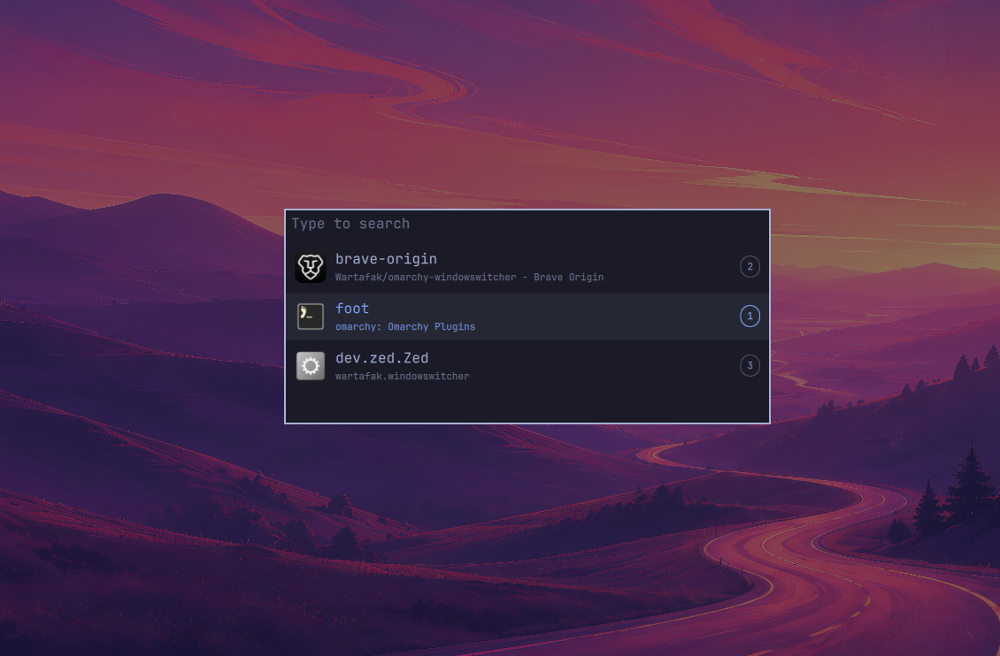

# WindowsWitcher — `wartafak.windowswitcher`

Show and navigate currently open windows. Yes, the pun is intended — the window's howling.

Window tracking approach inspired by
[rosakodu/omarchy-dock](https://github.com/rosakodu/omarchy-dock) (MIT).

## Screenshots

Top-bar icon strip and the `Super+Tab` switcher:




## Features

Top bar (`BarWidget.qml`):

- One icon per open window
- Icons grouped by workspace (workspace 1 first)
- Active window highlighted
- Left-click focuses, middle/right-click closes, hover shows the workspace tooltip
- Hides itself when there are no windows (zero width, no layout disturbance)
- Special workspaces (e.g. scratchpad) are excluded

Switcher overlay (`Switcher.qml`, `Super+Tab`):

- Quick tap toggles between the current and the last focused window
- Hold `Super` and press `Tab` / `Shift+Tab` to cycle through windows
- Releasing `Super` focuses the highlighted window
- `Up`/`Down` move the selection; selection also commits on `Super` release
- Click to focus, `Esc` to dismiss
- Windows listed most-recently-focused first


## Install

```sh
omarchy plugin add https://github.com/Wartafak/omarchy-windowswitcher.git --enable
omarchy bar put wartafak.windowswitcher --section left --after omarchy.workspaces
```

Super+Tab binding (`~/.config/hypr/bindings.lua`):

```lua
o.bind("SUPER + TAB", "All windows", "omarchy-shell shell summon wartafak.windowswitcher '{\"action\": \"cycle\"}'")
o.bind("SUPER + SHIFT + TAB", "Previous window", "omarchy-shell shell summon wartafak.windowswitcher '{\"action\": \"cycleBack\"}'")
o.bind("SUPER + SUPER_L", "Confirm window", "omarchy-shell shell summon wartafak.windowswitcher '{\"action\": \"confirm\"}'", { release = true })
o.bind("SUPER + SUPER_R", "Confirm window", "omarchy-shell shell summon wartafak.windowswitcher '{\"action\": \"confirm\"}'", { release = true })
```

macOS-style: first `Super+Tab` already highlights the last focused window
(MRU order, seeded from Hyprland's `focusHistoryID`), repeats cycle while
`Super` is held, releasing `Super` focuses the highlight via the `confirm`
release binding (the overlay's own `Super`-release handler is a fallback).
Quick `Super+Tab` tap toggles between current and last window. `Esc` closes,
click focuses.

`Super+Up/Down` is context-aware: while the switcher is open it moves the
selection (`cycleBack`/`cycle`), otherwise it keeps Hyprland's directional
window focus. This is a small router in `bindings.lua` that asks the
switcher via `omarchy-shell shell call wartafak.windowswitcher isOpen`.

The plugin never modifies your configuration on its own — the `bindings.lua`
entries above are an opt-in manual step. After editing QML or bindings,
reload with `hyprctl reload` + `omarchy-restart-shell`.

## Remove

```sh
omarchy plugin remove wartafak.windowswitcher
```

Also delete the `bindings.lua` entries you added above, if any.

## Dependencies

- Omarchy Quattro shell (Quickshell) and Hyprland (`hyprctl` ships with
  Hyprland).
- No extra packages, no elevated privileges, no background services.
  Window tracking runs in-process in the shell.

## License

MIT — see [LICENSE](LICENSE).

## Files

- `manifest.json` — id `wartafak.windowswitcher`, kinds `bar-widget` + `overlay`
- `BarWidget.qml` — icon strip (BarWidget base, RowLayout + Repeater)
- `Switcher.qml` — Super+Tab overlay (PanelWindow, live ToplevelManager list)
- `preview.png` — marketplace preview (the switcher overlay)
- `screenshots/` — `bar.png` (top-bar strip), `switcher.png` (overlay)
- `SwitcherLogic.js` — pure decision logic (open dispatch, selection math,
  MRU ordering, hyprctl matching), shared by QML and the unit tests
- `tests/logic.test.js` — unit tests, no dependencies
- `tests/integration.sh` — live end-to-end test via shell IPC + hyprctl

## Testing

All switcher decisions live in `SwitcherLogic.js` as dependency-free
functions, imported by `Switcher.qml` (`import "SwitcherLogic.js" as Logic`)
and by Node directly — so the same code that runs in the shell runs under
test. QML keeps only thin adapters plus live-QObject field extraction
(which the library never touches, so closed windows can't leak into tests).

```bash
omarchy plugin validate ~/.config/omarchy/plugins/wartafak.windowswitcher
node --test tests/   # 43 unit tests, no runner to install
./tests/integration.sh  # live: needs the shell + >= 2 windows, net-zero focus change
```

The integration test drives the real overlay through
`omarchy-shell shell summon/call` and the `debugState` accessor, asserting
preselect (index 1), arming, focus switch, symmetric toggle-back and
multi-cycle advance.

## Notes

- Hot-reload prints 3 `Binding loop detected for property "windows"`
  warnings per save; steady-state is silent and the widget works
  (verified via screenshots). Cosmetic only, still to root-cause.
- `windows` is updated imperatively via `syncWindows()`/`refresh()`
  with no-change guards so focus switches don't churn the Repeater.
